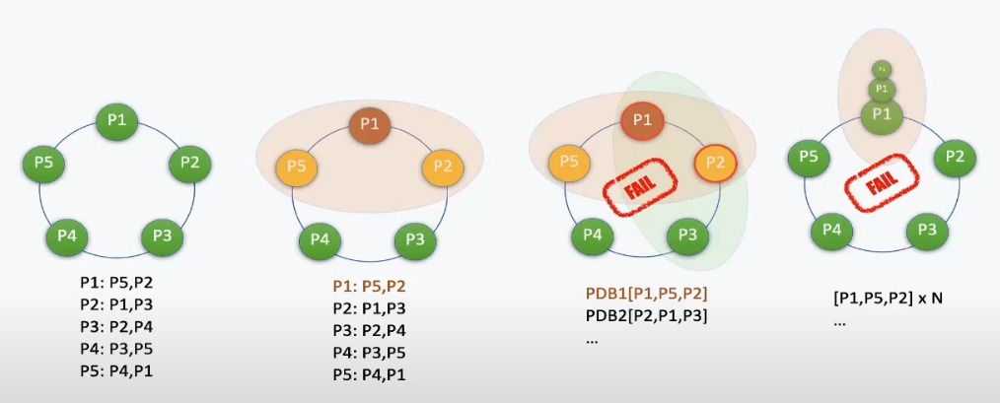
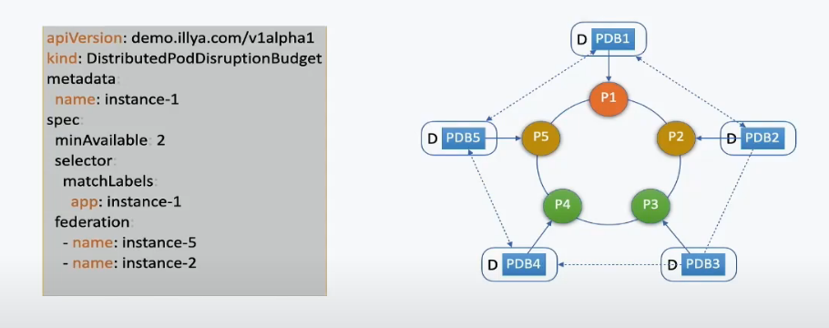
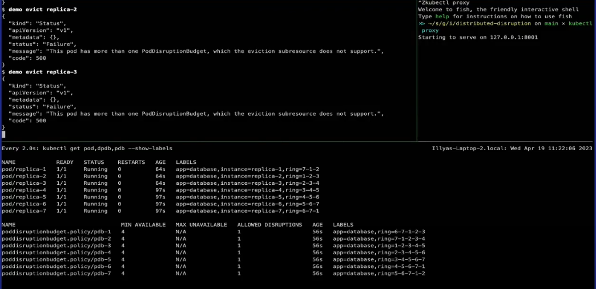
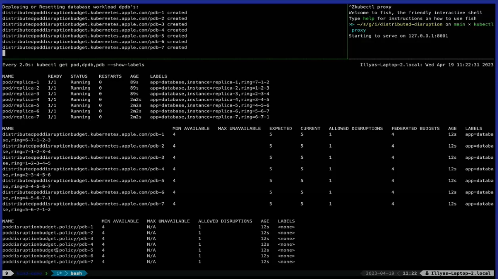
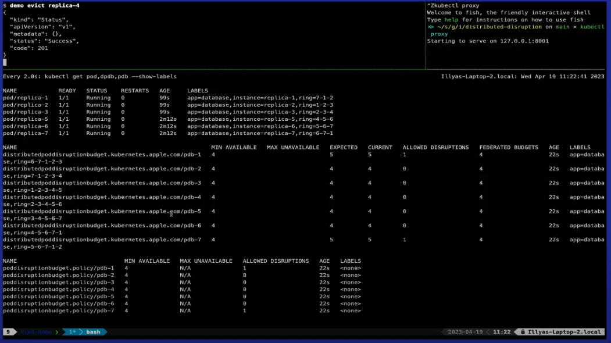
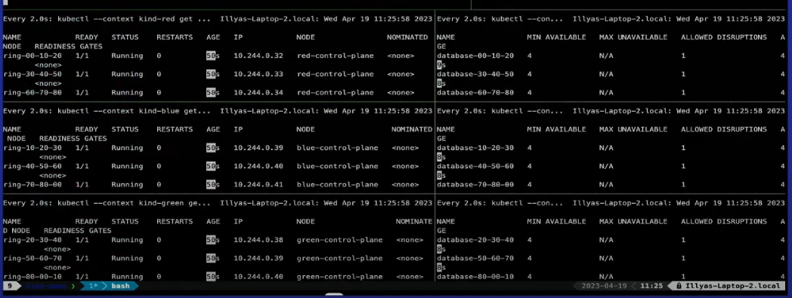
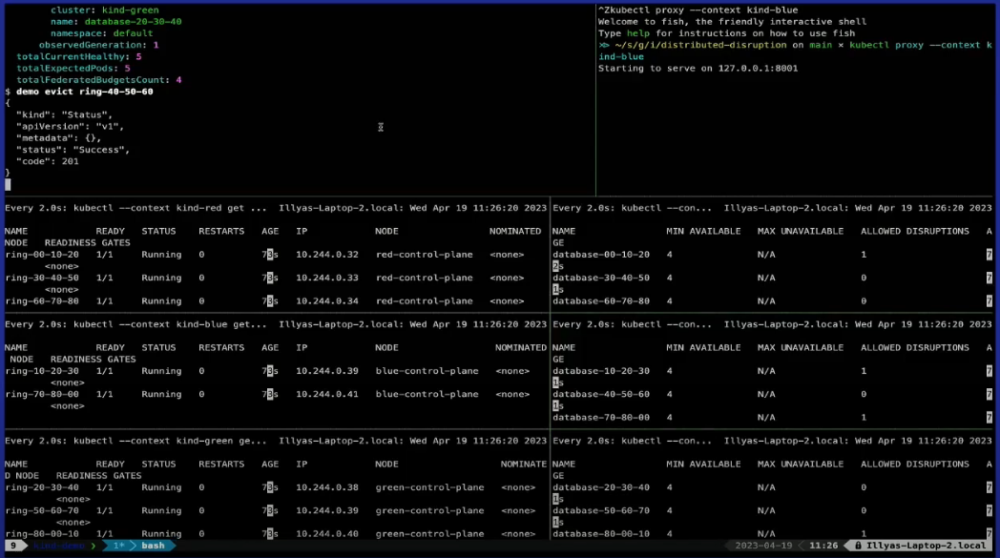

## 前言

发生在Pod上的干扰（Disruptions）可分为两种情况：

* 非自愿干扰（Involuntary），一般是出现了不可避免的硬件或软件系统错误。

- 节点下层物理机的硬件故障
- 虚拟机被错误地删除
- 内核错误
- 节点由于集群网络隔离从集群中消失
- Kubelet Eviction（节点资源不足）
- Taint-based Eviction

* 自愿干扰 （voluntary），包括应用所有者发起的操作和由集群管理员发起的操作。

- 应用所有者对应用的 Deletion，Update，Automation
- kubectl drain 排空节点
- scheduler Eviction 抢占式的调度
- 用户发起的驱逐操作 Eviction API

Kubernetes 引入了 PDB（PodDisruptionBudget）资源对象， 它能够一定程度上阻止 voluntary disruption 对应用运行的干扰，分析以下情况:

* 对于上述 Kubelet Eviction 以及 Taint-based Eviction，PDB 不起作用。
* 对于 Eviction API 引起的驱逐 （kubectl drain），PDB 能起到防护作用，对于 Eviction API 请求，返回 429 表示该请求不被允许。
* 对于 scheduler Eviction，PDB 可能起到作用，调度器在删除一个 Pod 时会参考 PDB 的配置，但不是决定性的因素。

PDB API 及示例说明：

```go
// PodDisruptionBudgetSpec is a description of a PodDisruptionBudget.
type PodDisruptionBudgetSpec struct {
	// An eviction is allowed if at least "minAvailable" pods selected by
	// "selector" will still be available after the eviction, i.e. even in the
	// absence of the evicted pod.  So for example you can prevent all voluntary
	// evictions by specifying "100%".
	// +optional
	MinAvailable *intstr.IntOrString

	// Label query over pods whose evictions are managed by the disruption
	// budget.
	// +optional
	Selector *metav1.LabelSelector

	// An eviction is allowed if at most "maxUnavailable" pods selected by
	// "selector" are unavailable after the eviction, i.e. even in absence of
	// the evicted pod. For example, one can prevent all voluntary evictions
	// by specifying 0. This is a mutually exclusive setting with "minAvailable".
	// +optional
	MaxUnavailable *intstr.IntOrString

	// UnhealthyPodEvictionPolicy defines the criteria for when unhealthy pods
	// should be considered for eviction. Current implementation considers healthy pods,
	// as pods that have status.conditions item with type="Ready",status="True".
	//
	// Valid policies are IfHealthyBudget and AlwaysAllow.
	// If no policy is specified, the default behavior will be used,
	// which corresponds to the IfHealthyBudget policy.
	//
	// IfHealthyBudget policy means that running pods (status.phase="Running"),
	// but not yet healthy can be evicted only if the guarded application is not
	// disrupted (status.currentHealthy is at least equal to status.desiredHealthy).
	// Healthy pods will be subject to the PDB for eviction.
	//
	// AlwaysAllow policy means that all running pods (status.phase="Running"),
	// but not yet healthy are considered disrupted and can be evicted regardless
	// of whether the criteria in a PDB is met. This means perspective running
	// pods of a disrupted application might not get a chance to become healthy.
	// Healthy pods will be subject to the PDB for eviction.
	//
	// Additional policies may be added in the future.
	// Clients making eviction decisions should disallow eviction of unhealthy pods
	// if they encounter an unrecognized policy in this field.
	//
	// This field is beta-level. The eviction API uses this field when
	// the feature gate PDBUnhealthyPodEvictionPolicy is enabled (enabled by default).
	// +optional
    // 定义条件来判定何时应考虑驱逐不健康的 Pod
	UnhealthyPodEvictionPolicy *UnhealthyPodEvictionPolicyType
}
```

```yaml
apiVersion: policy/v1
kind: PodDisruptionBudget
metadata:
    name: test
    namespace: default
spec:
    minAvailable: 3  # Healthy pod requirements (absolute or %-age)
    selector:        # Pod Selector
        matchLabels:
            app: test
status:
    currentHealthy: 6   # 当前健康的 Pod 数
    desiredHealthy: 3   # 最小期望的健康的 Pod 数
    disruptionsAllowed: 3   # 允许被干扰的 Pod 数
    expectedPods: 6     #  被 PDB 计算的总的 Pod 数
```

**Note**：Pod健康状态的判定即`.status.conditions`中包含`type="Ready"`和`status="True"`选项，则认为是健康的Pod。这些Pod会被PDB状态中的`.status.currentHealthy`字段所跟踪。

## 痛点

PDB遇到的问题：

- Namespace Scoped， 对于跨 ns 的 Pod 起不到防护作用
- Does not support complex identity pods，PDB 认为所有被选中的 Pod 是同一身份的，对于有状态的 Pod 很难防护
- Not Universal 防护的范围较小，对于部分非自愿干扰，用户可能也需要防护
- Err500 on multiple PDBs per Pod，多个PDB选中同一个Pod无法工作，直接返回500状态码
- Not extensible 没有扩展机制来接入一些其他需要考虑的因素

典型案例： 部署一个 NoSQL DB (Cassandra)



例如，我们希望能保证当前 Pod 及其关联的一组 Pod 中最多删除一个 Pod，一个简单的想法是配置 PDB 选中一组 Pod，如[P1, P2, P5], 对于多组 Pod 配置多个 PDB
但由于整个 statefulset 的关联关系是环形结构，因此不可避免地会导致一个 Pod 配置多个 PDB，但由于问题四这种方案无法实现。

注：使用sts部署Cassandra时，Pod是Cassandra的节点，并且是Cassandra集群的成员（称为ring），Cassandra 在后台使用 Gossip 协议，集群中的一个或多个节点充当给定数据片段的副本，
这意味着在指定的 Pod 间存在数据同步，我们希望通过 PDB 保护其数据及备份节点。

## Distributing PDB

Apple 引入了 DPDB 的 API，除了创建自身的 PDB 之外，可以索引跨命名空间或者跨集群的 PDB 或者 DPDB。




典型场景一：部署两个三个实例的 Deployment 到两个 Namespace （foo 和 bar）中，我们希望对于 foo 中的 Deployment 而言当两个 Deployment 的实例总数低于3时不允许驱逐。

为 bar 中的 deployment 部署 PDB (最小不允许小于3)
```yaml
metadata:
    name: test
    namespace: bar
spec:
    minAvailable: 3
    selector: 
        matchLabels:
            app: test
```

为 foo 中的 deployment 部署 DPDB
```yaml
spec:
    federation:
    - name: test
      namespace: bar
    minAvailable: 3
    selector:
        matchLabels:
            app: test
status:
    childStatus:
    #...
    federatedStatuses:
    #...
```

DPDB 会在当前 NS 创建一个 child PDB:
```yaml
metadata:
    ownerReference:
    # 指向 DPDB
spec:
    minAvailable: 3
    selector: 
        matchLabels:
            app: test
status:
    currentHealthy: 3   
    desiredHealthy: 3   
    disruptionsAllowed: 3   
    expectedPods: 3     
```

典型场景二：部署两个三个实例的 Deployment 到两个 Namespace （foo 和 bar）中，我们希望对于任意一个 Deployment 而言实例总数低于3时不允许驱逐。

分别为上述两个 Deployment 部署 DPDB，索引另一个 DPDB。

为 foo 中的 deployment 部署 DPDB
```yaml
metadata:
    name: test
    namespace: foo
spec:
    federation:
    - name: test
      namespace: bar
    minAvailable: 3
    selector:
        matchLabels:
            app: test
status:
    childStatus:
    #...
    federatedStatuses:
    #...
```

为 bar 中的 deployment 部署 DPDB
```yaml
metadata:
    name: test
    namespace: bar
spec:
    federation:
    - name: test
      namespace: foo
    minAvailable: 3
    selector:
        matchLabels:
            app: test
status:
    childStatus:
    #...
    federatedStatuses:
    #...
```

典型场景三：使用 statefulset 创建一个 NoSql DB 应用，假设应用的 Pod 分布如下:

使用原生 PDB：



使用 DPDB, 并尝试驱逐一个 Pod：





典型场景四：使用 statefulset 创建一个 NoSql DB 应用，Pod分布在不同的集群上。DPDB 控制器安装在每个集群中，传入包含多个集群 context 的 kubeconfig。

DPDB示例：

```yaml
metadata:
    labels: 
        app: database
        cluster: kind-red
    name: database-00-10-20
spec:
    federation:
    - cluster: kind-blue
      name: database-70-80-00
      namespace: default
    - cluster: kind-green
      name: database-80-00-10
      namespace: default
    - cluster: kind-blue
      name: database-10-20-30
      namespace: default
    - cluster: kind-green
      name: database-20-30-40
      namespace: default
    minAvailable: 4
    selector:
        matchLabels:
            ring: 00-10-20
```



